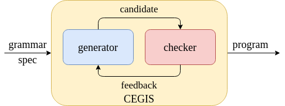
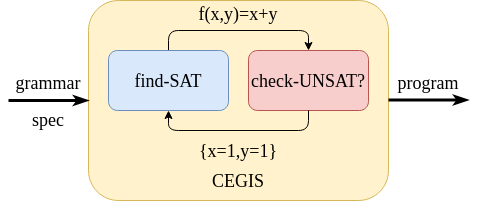

# Counterexample-guided Inductive Synthesis

CEGIS takes a grammar and a specification, 
and outputs a program defined in the grammar satisfying the spec.

Formally, it solves formula of the form 

```math
\exists f . \forall x, y, \dots . \phi
```

where $\phi$ is the specification and $f(x,y,\dots)$ is a program
drawn from the given grammar. 

For example, we can ask for a function satisfying the following spec:

```math
\exists f . \forall x, y . f(x,y) \geq x \wedge f(x,y) \geq y \wedge (x = f(x,y) \vee y = f(x,y))
```
In English, $f(x,y)$ must be no less than both x and y,
and it should be equal to either x or y 
(hint: it's the function `max`).

The essence of CEGIS is illustrated by this picture:



The generator generates candidate programs drawn from the grammar, 
and the checker checks the candidates against the spec for correctness.
If a candidate satisfies the spec, 
CEGIS outputs it as the solution.
Otherwise the checker asks the generator for more candidates, 
possibly providing some feedback to the generator. 

A naive instantiation of this process 
uses exhaustive enumeration as the generator, 
and random testing as the checker. 
The generator simply proposes programs small to large
by following some BNF grammar, 
and the checker runs the candidate on random inputs 
and tests if the spec is satisfied.

Another instantiation of this process
uses human software engineers as the generator, 
and human testing engineers as the checker.
But let's focus on machines and ignore humans from now on. 

The naive instantiation has some problems:
1. the checker is unsound, because random testing is not exhaustive.
2. the generator running exhaustive enumeration is extremely inefficient.
3. if a test fails on the checker's side,
the generator doesn't know *why* it failed.
That is, the feedback from the checker is not very informative.

To fix the first shortcoming, we can replace random testing with 
automated verification. 
Specifically, we use SMT-solvers,
which either verifies the correctness of the candidate,
or returns a *counterexample*. 
The counterexample is an input to the candidate program, 
so that running the program on it produces a result that violates the spec.
Using an SMT-solver, our checker guarantees the correctness of 
any candidate that passes the check. 
It also provides the counterexample as a feedback that explains *why* 
a failing candidate is incorrect. 

To be more concrete, let's take our spec for *max* above, 
and use the following simple grammar: 

```
e := x + y | max(x,y)
```

Suppose the generator proposes $\max(x,y)$ as a candidate;
the checker then instantiates the spec with $f=\max$:

```math
\forall x, y . \max(x,y) \geq x \wedge \max(x,y) \geq y \wedge (x = \max(x,y) \vee y = \max(x,y))
```

To check the validity of this formula, the checker simply drops the $\forall$
and asks the solver if the *negation* of the body is satisfiable:

```math
\text{SAT?} \Big( \neg \big( \max(x,y) \geq x \wedge \max(x,y) \geq y \wedge (x = \max(x,y) \vee y = \max(x,y)) \big) \Big)
```

This is unsatisfiable, meaning *no* values of x and y can make the negated spec true.
That is the same as saying no x and y can make the orignal spec false.
Therefore the candidate is correct. 

If the generator proposes x+y as a candidate, 
the checker will instantiate the spec with f=+ 
and check for the following formula:

```math
\text{SAT?} \Big( \neg \big( x+y \geq x \wedge x+y \geq y \wedge (x = x+y \vee y = x+y) \big) \Big)
```

Clearly this is satisfiable: when x=y=1, x+y=2 equals to neither x nor y. 
The checker therefore rejects the candidate 
and provides {x=1, y=1} as the counterexample. 

The next step is to improve the generator, 
so that it can take advantage of the feedback 
when it proposes the next candidate.
Remarkably, this too can be implemented with an SMT-solver!
The idea is, we want to find a program that satisfies the spec
*on all counterexamples encountered so far*. 
This program also needs to be drawn from the grammar.

The important insight is that **the grammar can be expressed as an SMT formula**!
To do so, we simply introduce a boolean "switch" for every choice in the grammar.

For example, our grammar above becomes:

```
if?b then:f=x+y else:f=max(x,y)
```

In first order logic, this is

```math
(b \Rightarrow f(x,y) = x + y) \wedge (\neg b \Rightarrow f(x,y) = max(x,y))
```

With this encoding, we just need to decide the right value for b such that 
the spec is satisfied:

```math
(b \Rightarrow f = +) \wedge (\neg b \Rightarrow f = \max) \wedge
\forall x, y . f(x,y) \geq x \wedge f(x,y) \geq y \wedge (x = f(x,y) \vee y = f(x,y))
```

There is one last wrinkle: we need to remove the $\forall$ quantification, 
since quantified formula are usually undecidable. 
So instead of solving for all x and y, we instantiate the formula with the
counterexamples:

```math
b \Rightarrow f = + \wedge \neg b \Rightarrow f = \max \wedge
f(1,1) \geq 1 \wedge f(1,1) \geq 1 \wedge (1 = f(1,1) \vee 1 = f(1,1))
```
After "inlining" f, this becomes:

```math
b \Rightarrow 1+1 \geq 1 \wedge 1+1 \geq 1 \wedge (1 = 1+1 \vee 1 = 1+1)
```
```math
\wedge \neg b \Rightarrow \max(1,1) \geq 1 \wedge \max(1,1) \geq 1 \wedge (1 = \max(1,1) \vee 1 = \max(1,1))
```

Now it's very easy to see that b must be false to make the above true,
and an SMT-solver would return exactly that.
We encountered only 1 counterexample pair {x=1, y=1}; 
had we found more, the generator would instantiate the formula for each of them.
For example, if we also have {x=2, y=2} as an CE, the instantiation would be: 

```math
b \Rightarrow 2+2 \geq 2 \wedge 2+2 \geq 2 \wedge (2 = 2+2 \vee 2 = 2+2)
```
```math
\wedge \neg b \Rightarrow \max(2,2) \geq 2 \wedge \max(2,2) \geq 2 \wedge (2 = \max(2,2) \vee 2 = \max(2,2))
```
```math
\wedge b \Rightarrow 1+1 \geq 1 \wedge 1+1 \geq 1 \wedge (1 = 1+1 \vee 1 = 1+1)
```
```math
\wedge \neg b \Rightarrow \max(1,1) \geq 1 \wedge \max(1,1) \geq 1 \wedge (1 = \max(1,1) \vee 1 = \max(1,1))
```

This encoding can be easily extended to recusive grammars,
if we bound the depth of the grammar and gradually increase this bound.
The reader can take up as a challenge to figure out how exactly to achieve this.

Stepping back, we see that the generator and checker of CEGIS are implemented by a pair of **dueling solvers**,
as shown in the picture below.



On the checker's side:
1. the spec is instantiated with f replaced by the candidate program, 
2. the solver checks the *validity* of the instantiation: 
it outputs the candidate when valid, and gives a counterexample otherwise.

On the solver's side:
1. the spec is instantiated with f drawn from the grammar, 
as well as x,y bound to the CEs.
2. the solver tries to *satisfy* the instantiation:
it proposes a candidate if the formula is satisfiable.
Otherwise, the synthesis problem has no solution.

CEGIS is effective 
because the generator constantly improves its proposal upon every feedback.
Because the feedback from the checker accumulates more and more counterexamples,
the generator will propose programs that are correct on more and more inputs.
In a sense, the candidate gets "more and more correct" every time the loop goes around.
And when the checker finally OK's the candidate, it is guaranteed to be sound. 
Compare this to exhaustive enumeration: every time the loop comes around, 
there's no guarantee that the new candidate will be "more correct".
Even though enumerating the next expression is much faster than SMT-solving,
exhaustive enumeration would still incur exponentially many calls to the checker.

## Acknowledgement

I first learned of CEGIS from [Emina Torlak](https://homes.cs.washington.edu/~emina/)'s 
[course](https://courses.cs.washington.edu/courses/cse507/) at UW. 
After that I keep going back to 
[these](https://www.cs.utexas.edu/~bornholt/post/synthesis-explained.html)
[posts](https://www.cs.utexas.edu/~bornholt/post/building-synthesizer.html) 
by [James Bornholt](https://www.cs.utexas.edu/~bornholt/) 
for reference.
But the posts don't explain how the solver works in the generator, 
and that's why I wrote this post.

I highly recommend [Rosette](https://emina.github.io/rosette/)
if you want to get your hands dirty syntheisizing some programs - 
it's a rock-solid language that is an absolute joy to use.

## References

Armando Solar-Lezama, Liviu Tancau, Rastislav Bodik, Sanjit Seshia, and Vijay Saraswat. 2006. Combinatorial sketching for finite programs. In Proceedings of the 12th international conference on Architectural support for programming languages and operating systems (ASPLOS XII). Association for Computing Machinery, New York, NY, USA, 404–415. DOI:https://doi.org/10.1145/1168857.1168907
