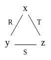

# Generic Join Algorithms

This post introduces the basics of the worst-case optimal Generic Join algorithm.

## The AGM Bound

Given a database (set of relations) and a query (natural join of relations),
we want to know how large the query output can be.
A really stupid bound just multiplies the size of each relation,
because that is the size of their cartesian product.
That is, given the query 
```math
Q(x,y,z) \leftarrow R(x,y), S(y,z), T(x,z).
```
we have the bound $|Q| \leq |R| \times |S| \times |T|$. 

If $|R|=|S|=|T|=N$, then $|Q| \leq N^3$. 
We can do better - at least we know $|Q| \leq |R| \times |S| = N^2$.
That is because Q contains fewer tuples than the query 
```math
Q’(x,y,z) \leftarrow R(x,y), S(y,z).
```
since Q further joins with T.

The best possible theoretical bound is the AGM bound, 
which is $N^{3/2}$ for Q. 
It’s computed from the fractional edge cover of the query hypergraph.

## Query Hypergraph

The hypergraph of a query is simply the hypergraph 
where the vertices are the variables and the edges are the relations.

Q’s hypergraph looks like this: 



A non-binary (e.g. ternary) relation will become a hyperedge
that connects more than 2 vertices. 

## Fractional Edge Cover

A set of edges *cover* a graph if they touch all vertices. 
For Q’s hypergraph, any two edges form a cover.
A *fractional edge cover* assigns a weight to each edge from 0 to 1;
the weight of a vertex is the sum of the edges it touches.
In a fractional cover, every vertex must have weight at least 1.
Every edge cover is a fractional cover,
because we just assign 1 to every edge in the cover 
and 0 to edges not in the cover.
For Q’s hypergraph, 
$R \rightarrow 1/2, S \rightarrow 1/2, T \rightarrow 1/2$ is also a fractional cover.
The AGM bound is defined to be $\min_{w_1,w_2,w_3} |R|^{w_1}|S|^{w_2}|T|^{w_3}$ 
where $R \rightarrow w_1, S \rightarrow w_2, T \rightarrow w_3$ is a fractional cover.
This is the upper bound of Q’s output size;
i.e. in the worst case Q outputs this many tuples.

## Generic Join

We would like an algorithm that runs in time linear to the worst case output size,
and Generic Join is such an algorithm (with a log factor).
It has one parameter: a global variable ordering.
It is an ordering of the set of Q’s variables, say $[x,y,z]$.
Any ordering works (achieves the worst-case complexity) in theory,
but different ordering performs very differently in practice.
Given an ordering,
we assume the input relations are stored in tries sorted by the ordering.
That is, given the ordering $[x,y,z]$,
$R(x,y)$ is sorted by x and then y,
and the first-level trie nodes are the x’s.

Even more concretely, if $R=\{(3, 4), (2, 1), (2, 5)\}$, 
then its trie looks like this (each box is sorted): 


We can very efficiently intersect (join) relations on their 
first (according to the variable ordering) variable given such tries.

The Generic Join algorithm for computing Q is as follows:

```
Q(x,y,z) = R(x,y),S(y,z),T(z,x)
# variable ordering [x,y,z]

A= R(x,y).x ∩ T(z,x).x 
for a in A do
  # compute Q(a,y,z) = R(a,y),S(y,z),T(z,a)
  B= R(a,y).y ∩ S(y,z).y
  for b in B do
     # compute Q(a,b,z) = R(a,b),S(b,z),T(z,a)
     C= S(b,z).z ∩ T(z,a).z
     for c in C do
         output (a,b,c)
```

Note that selection, e.g. $R(a, y)$ is free / very fast because we have the tries.
$A \cap B$ can also be done in $\tilde{O}(\min(|A|, |B|))$ time 
($\tilde{O}$ means O with a log factor).
For general queries we may have to intersect more than 2 relations,
in which case the intersection must be performed in 
$\tilde{O}(\min_i|A_i|)$ time (using the merge in merge-sort). 

## When to Use Generic Join

Use Generic Join when the query is cyclic - if the query is acyclic,
the theoretical optimal algorithm is Yannakakis 
(equivalent to message passing in probabilistic graphical models)
which runs in linear time in the input size;
in practice people use binary joins for acyclic queries,
because Yannakakis always incurs a constant factor of 3 (it’s a 3-pass algorithm). 

In practice, Generic Join may have good performance compared to binary joins,
since it is sometimes equivalent to a linear join tree.
The “average case” complexity of Generic Join is open. 

## References

Hung Q Ngo, Christopher Ré, and Atri Rudra. 2014. Skew strikes back: new developments in the theory of join algorithms. SIGMOD Rec. 42, 4 (December 2013), 5–16. DOI:https://doi.org/10.1145/2590989.2590991

Hung Q. Ngo, Ely Porat, Christopher Ré, and Atri Rudra. 2012. Worst-case optimal join algorithms: [extended abstract]. In Proceedings of the 31st ACM SIGMOD-SIGACT-SIGAI symposium on Principles of Database Systems (PODS '12). Association for Computing Machinery, New York, NY, USA, 37–48. DOI:https://doi.org/10.1145/2213556.2213565

Veldhuizen, Todd L. "Leapfrog triejoin: A simple, worst-case optimal join algorithm." arXiv preprint arXiv:1210.0481 (2012).

Mihalis Yannakakis. 1981. Algorithms for acyclic database schemes. In Proceedings of the seventh international conference on Very Large Data Bases - Volume 7 (VLDB '81). VLDB Endowment, 82–94.
